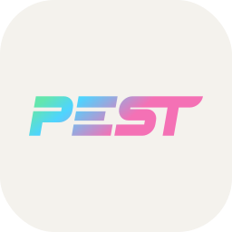

<!--
  Preview: Ctrl+Shift+V · Iconos necesitan internet
-->

<h1 align="center">Hola, soy Ismael</h1>

  <strong>Software Architect · Tech Lead · Full Stack</strong> 
  
  &nbsp;
  

  
  

  

### Sobre mí

Llevo **+8 años** en backend, evolucionando a Software Architect / Tech Lead hands-on: diseño de arquitectura, liderazgo de equipos y trabajo cercano con Producto y Diseño, sin abandonar el código. He trabajado en sistemas de alto tráfico (~100M visitas/mes) y en el día a día aplico **DDD**, **SOLID**, arquitectura hexagonal / por capas, eventos de dominio y APIs pensadas para mantenerse.

Con **IA** he podido acercarme a áreas que antes eran más lejanas — DevOps, producto, análisis de datos, tests — y ganar velocidad en el ciclo de un feature. Ahora ando explorando la automatización de flujos con **agentes**, **MCP** e integraciones con modelos: lo uso como acelerador — *engineering-backed vibe coding*: criterio hands-on, conocer el stack y los entresijos, para crecer con solidez.

---

### Stack

  
  
  
  
  
  
  
  
  
  
  
  
  
  
  
  
  
  
  
  
  
  
  
  
  
  
  
  
  
  
  
  

Mi día a día es **PHP** (Slim / Laravel), con **Python**/Django y **TypeScript** cuando el proyecto lo pide. En PHP sigo estándares **PSR**, domain events, colas, Horizon, WebSockets, Reverb y SSE. Assets frontend con **Vite** (Laravel). Tests con **PHPUnit**, **Pest** e **Infection**. IDEs: **PhpStorm** y **VS Code**.

Persistencia y caché: **MySQL**/MariaDB, **PostgreSQL**, Elasticsearch, Redis y Memcached. Frontend: **Vue**, **React**, **Next.js** y **Tailwind**. Entrega e infra: **Docker**, Bash, GitHub Actions, Tekton, **GCP**, Pub/Sub, **Nginx** + **PHP-FPM**, Kubernetes y Terraform (el cluster lo gestiona SRE).

---

### Integraciones

  
  &nbsp;
  
  &nbsp;
  
  &nbsp;
  
  &nbsp;
  
  &nbsp;
  

He integrado **Stripe**, **Chargebee**, **PayPal**, **Salesforce**, **Minderest** y **Atlassian/Jira** — APIs, **OAuth**, auth, webhooks y sincronización.

---

### Herramientas de IA

  
  &nbsp;
  
  &nbsp;
  

Uso **Claude** y **Cursor** en el día a día; **Vertex AI** en producto (GCP). Automatizo con agentes, **MCP**, APIs / OpenRouter e integraciones con modelos.

---

### En mi tiempo libre

Homelab autoalojado con **Docker**, Traefik, Authelia, WireGuard y Cloudflare: despliegues, redes y automatización.

  
  &nbsp;
  
  &nbsp;
  
  &nbsp;
  

